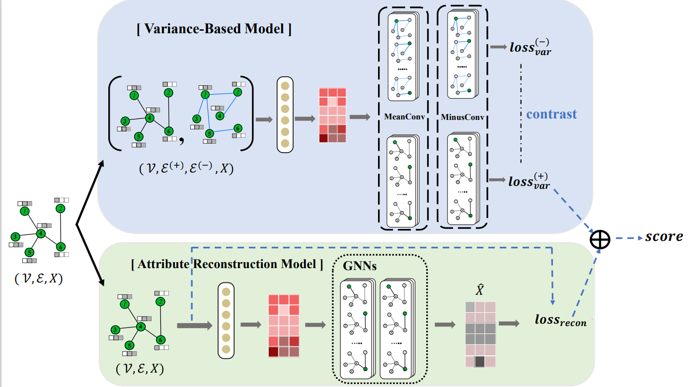

# Unsupervised Graph Outlier Detection: Problem Revisit, New Insight, and Superior Method

This is the source code of  paper ”Unsupervised Graph Outlier Detection: Problem Revisit, New Insight, and Superior Method“ (https://arxiv.org/abs/2210.12941)

This paper has been accepted by ICDE 2023.

The previous title of paper is "Are we really making much progress in unsupervised graph outlier detection? Revisiting the problem with new insight and method".




## Requirements

This code requires the following:

- Python>=3.7
- PyTorch>=1.12.1
- Numpy>=1.19.2
- Scipy>=1.6.2
- Scikit-learn>=0.24.1
-  PyG  >= 2.1.0  &&  PyG <= 2.4.0

## Running the experiments

### UNOD experiment

#### step 1: inject outlier

 This is a pre-processing step which injects outliers into the original clean datasets. Take Cora dataset as an example: 

```
python inject_anomaly.py --dataset cora
```

 After outlier injection, the disturbed datasets are saved into "data" folder 

#### step 2: outlier detection

 This step is to run the **VGOD** framework to detect outliers in the network datasets. Take Cora dataset as an example: 

```
python train_sep.py --data cora
```


### Structural outlier detection experiment under different injection parameters

#### step 1: inject outliers

 This is a pre-processing step which injects outliers into the original clean datasets. 

```
python inject_struct_anomaly_groups.py
```

 After outlier injection, the disturbed datasets are saved into "struct_datasets" folder 

#### step 2: outlier detection

 This step is to run the **VBM** to detect outliers in the network datasets. 

```
python struct_ano_detect_groups.py --data Cora
```

```
python struct_ano_detect_groups.py --data Citeseer
```

```
python struct_ano_detect_groups.py --data PubMed
```

```
python struct_ano_detect_groups.py --data Flickr
```

### Structural outlier detection experiment under a new injection approach

Since the current injection approach will cause a serious data leakage issue as mentioned in our paper, we devise a new structural outlier injection approach to avoid the data leakage issue. More details can be found in our paper.

#### step 1: inject outliers

This is a pre-processing step which injects outliers into the original clean datasets.

```
python inject_strcut_anomaly_new_approach.py
```

After outlier injection, the disturbed datasets are saved into "NovelStr_datasets" folder

#### step 2: outlier detection

This step is to run the **VBM** to detect outliers in the network datasets.

```
python struct_ano_detect_new_approach.py
```

# Citation
If you find our work useful, please consider citing our paper below. Thank you!
```
@INPROCEEDINGS{vgod,
  author={Huang, Yihong and Wang, Liping and Zhang, Fan and Lin, Xuemin},
  booktitle={2023 IEEE 39th International Conference on Data Engineering (ICDE)}, 
  title={Unsupervised Graph Outlier Detection: Problem Revisit, New Insight, and Superior Method}, 
  year={2023},
  volume={},
  number={},
  pages={2565-2578},
  keywords={Representation learning;Data engineering;Data models;Anomaly detection;Graph Outlier Detection;Graph Neural Network;Unsupervised Graph learning;Attributed Networks},
  doi={10.1109/ICDE55515.2023.00197}}
```
